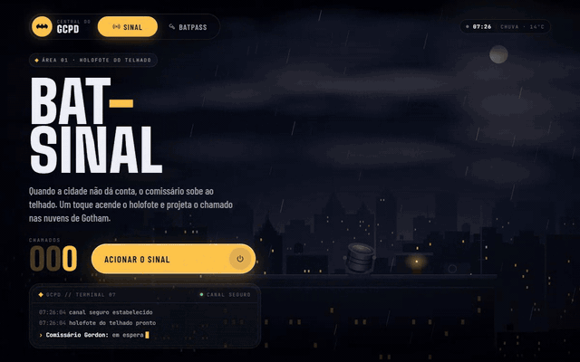
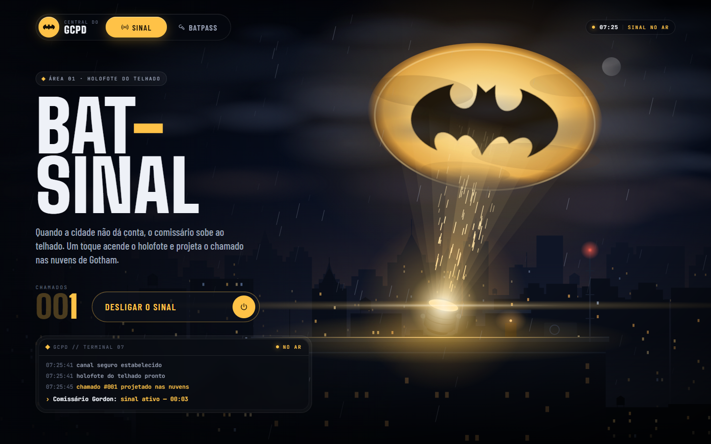
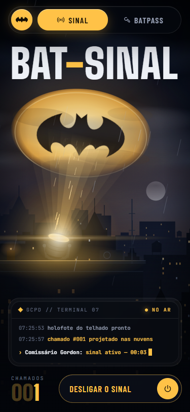
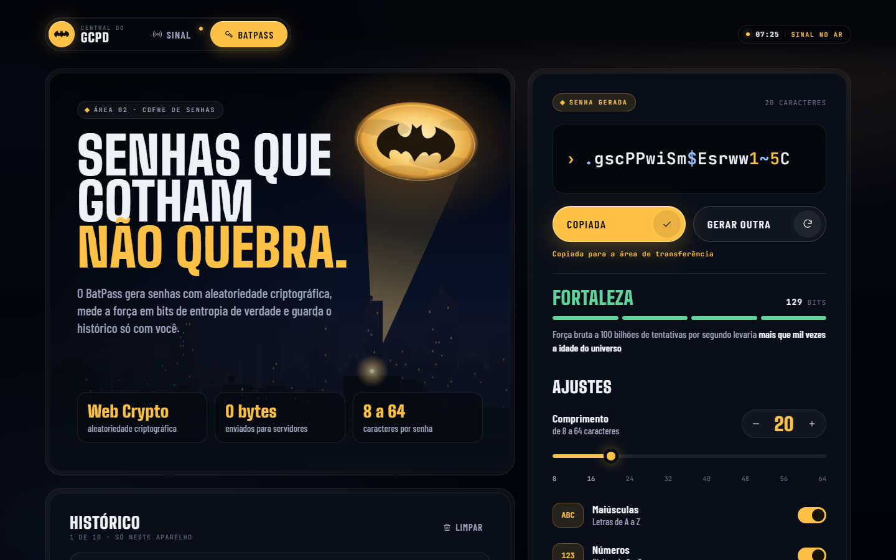
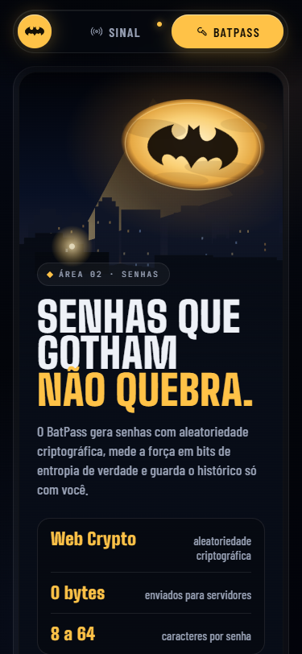

# Bat-Sinal

A Central do GCPD num app React Native: acenda o holofote que projeta o morcego nas nuvens de Gotham e, na área ao lado, gere senhas fortes com o BatPass. Funciona no celular e na web.

**[Ver ao vivo →](https://leandromlmoreira.github.io/bat-sinal/)** · **[Abrir direto no BatPass →](https://leandromlmoreira.github.io/bat-sinal/#batpass)**



<p>
  
  
</p>
<p>
  
  
</p>

## Duas áreas, uma central

A barra flutuante no topo alterna entre as áreas. Na troca, o emblema do Bat-Sinal aparece no centro e a câmera mergulha no morcego até a outra área surgir. Na web cada área tem endereço próprio (`#batpass`), então dá para compartilhar o link e o botão voltar do navegador funciona. Com o sinal ligado, a aba Sinal ganha um ponto âmbar para lembrar que o holofote continua no ar.

### Sinal

- **Gotham à noite, desenhada em código.** Skyline em três camadas com parallax sutil (e reação ao mouse na web), janelas que apagam e voltam, nuvens baixas em movimento, lua encoberta e chuva fina em duas profundidades.
- **Ignição com estalo.** O holofote dá um estalo de luz, o feixe sobe gaguejando como um arco de carbono e só então o morcego aparece nas nuvens, com halo e tremulação leve.
- **Terminal do GCPD** com log de eventos e status ao vivo (`Comissário Gordon: sinal ativo — 00:14`), mais o **contador de chamados** animado a cada acionamento.

### BatPass

- **Aleatoriedade criptográfica.** `getRandomValues` (Web Crypto via `expo-crypto`) com amostragem por rejeição, sem viés de módulo e sem `Math.random`.
- **Opções completas.** Comprimento de 8 a 64 (slider arrastável e botões de passo), maiúsculas, números, símbolos e evitar caracteres ambíguos. Cada tipo ativo aparece ao menos uma vez, com embaralhamento Fisher-Yates.
- **Força em bits de entropia de verdade** (`comprimento × log2(alfabeto)`), quatro níveis e estimativa de força bruta a 100 bilhões de tentativas por segundo.
- **Copiar com feedback** e **histórico mascarado** das últimas 10 senhas copiadas, guardado só no aparelho (AsyncStorage, `localStorage` na web).

### Em todo o app

- **Identidade única.** Big Shoulders, Barlow Condensed e JetBrains Mono, a paleta âmbar do holofote e o mesmo morcego clássico no logo, na projeção, no hero do BatPass, no favicon e nos ícones do app.
- **Layouts de verdade para cada tela.** Composição vertical no celular, colunas no desktop e modo compacto para celular deitado ou telas baixas.
- **Cuidados de produto.** Vibração ao acionar o sinal (iOS/Android), hover e foco visível só na navegação por teclado, estados de vazio e carregando, respeito a "reduzir movimento" (a transição vira um fade curto e as animações param) e animações apenas em `transform` e `opacity`.

## Stack

- [Expo](https://docs.expo.dev/) SDK 57 + React Native 0.86, TypeScript
- [react-native-svg](https://github.com/software-mansion/react-native-svg) para a cena, o emblema e as ilustrações
- API `Animated` com `useNativeDriver` no celular
- `expo-crypto`, `expo-clipboard`, `@react-native-async-storage/async-storage`, `expo-haptics`
- `expo-font` com Big Shoulders, Barlow Condensed e JetBrains Mono (Google Fonts)
- Testes das regras de negócio com o test runner nativo do Node
- Deploy da versão web no GitHub Pages via GitHub Actions

## Arquitetura

```
src/
  screens/     Central (troca de áreas), Signal (cena do holofote) e BatPass
  components/  shell (barra e transição), scene (Gotham), batpass e ui compartilhada
  domain/      regras puras e testadas do BatPass: geração, entropia, histórico
  services/    aleatoriedade segura e armazenamento local
  hooks/       estado do sinal, do gerador, da rota e da transição
  lib/         geradores determinísticos de skyline e chuva
  theme/       cores, fontes e curvas de animação
```

## Como rodar

```bash
git clone https://github.com/leandromlmoreira/bat-sinal.git
cd bat-sinal
npm install
npm start
```

Escaneie o QR code com o Expo Go ou abra direto numa plataforma:

```bash
npm run web       # navegador
npm run android   # emulador ou dispositivo Android
npm run ios       # simulador ou dispositivo iOS
```

## Qualidade e deploy

```bash
npm run typecheck   # tsc --noEmit
npm run lint        # eslint-config-expo
npm test            # 19 testes: domínio do BatPass e barra da central
npm run build       # exporta a versão web estática para dist/
```

A cada push na `main`, o workflow `deploy-pages.yml` checa tipos, lint e testes, exporta a web com `baseUrl` `/bat-sinal` (definido no `app.json`) e publica no GitHub Pages.

O BatPass nasceu num repositório separado e foi trazido para cá com `git subtree`, então todo o histórico dele continua no `git log` deste projeto.

## Créditos

- Símbolo do morcego: [Batman, do SVG Repo](https://www.svgrepo.com/svg/485626/batman), usado na projeção, no logo, no hero do BatPass, no favicon e nos ícones em `assets/`.
- Batman e o Bat-Sinal são marcas registradas da DC Comics. Este é um projeto de fã, sem fins comerciais e sem vínculo com a DC.

---

<sub>Nasceu dos desafios "Recrie um app de Bat-Sinal" e do gerador de senhas da trilha de React Native da DIO, este inspirado no projeto de referência de Felipe Aguiar.</sub>
